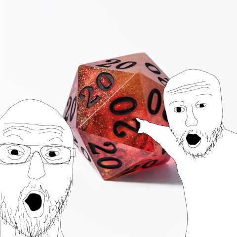

# Roll command

Random server command for D&D and other tabletop games

## Use:

`/roll` - returns random value (MIN - MAX)

`/roll [MAX]` - (1-MAX)

`/roll [MIN] [MAX]` - (MIN - MAX)

`/roll d[SIDES]` - returns dice random value (1-SIDES) and marks critical success and fail

`/roll [ROLL_COUNT]d[SIDES]` - returns ROLL_COUNT random values

## Examples:

`/roll` - Player rolls (1-100): 52

`/roll 10` - Player rolls (1-10): 5

`/roll 5 67` - Player rolls (5-67): 6

`/roll d20` - Player rolls (d20): 1

`/roll 2d20` - Player rolls (2d20): 1, 20

## Config:

MaxRollCount - prevents a player from rolling more dice than specified (default: 10)

MaxDiceSides - prohibits a player from having a dice with more sides than specified (default: 100)

ProtectMainChanel - prevents a player from using a command in global chat (default: true)

MessageColor - color of message (default: #ffaa00)

CriticalSuccessColor - color of critical success for roll dice (default: #55ff55)

CriticalFailColor - color of critical fail for roll dice (default: #ff4400)
